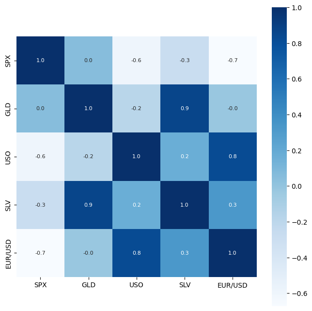
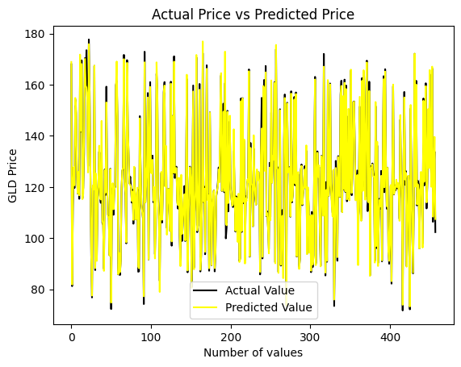

# GoldPricePredicton
A machine learning model to predict the price of gold using correlation and random forest.
# Gold Price Prediction using Machine Learning

## Project Overview

This project predicts gold prices using historical financial data and machine learning techniques.

The objective is to understand the complete machine learning workflow, including data preprocessing, exploratory data analysis, feature selection, model training, and performance evaluation.

---

## Problem Statement

Gold prices are influenced by multiple economic factors such as:

- Stock market indices
- Currency exchange rates
- Commodity prices
- Economic uncertainty

The goal is to build a regression model capable of predicting gold prices from historical market data.

---

## Dataset

Dataset contains historical market indicators and gold prices.

Features include:

- SPX (S&P 500 Index)
- USO (Oil ETF)
- SLV (Silver ETF)
- EUR/USD Exchange Rate

Target Variable:

- Gold Price (GLD)

---

## Technologies Used

- Python
- NumPy
- Pandas
- Matplotlib
- Seaborn
- Scikit-Learn
- Google Colab

---

## Machine Learning Pipeline

### 1. Data Preprocessing

- Checked missing values
- Removed inconsistencies
- Feature-target separation

### 2. Exploratory Data Analysis

- Correlation analysis
- Distribution visualization
- Feature relationship study

### 3. Model Training

Model Used:

- Random Forest Regressor

Training Procedure:

- Train-Test Split
- Hyperparameter experimentation

### 4. Model Evaluation

Metrics:

- R² Score

---

## Results

| Metric | Score |
|----------|----------|
| Test R² | 0.989|

The model successfully captured relationships between financial indicators and gold prices.

---

## Visualizations

### Correlation Heatmap



### Predicted vs Actual Prices



---

## Key Learnings

Through this project I learned:

- Regression modeling
- Feature importance analysis
- Model evaluation techniques
- Data preprocessing workflows
- End-to-end machine learning pipeline design

---

## Future Improvements

- XGBoost implementation
- Time-series forecasting models
- Cross-validation experiments
- Hyperparameter optimization

---

## How to Run

Clone the repository:

```bash
git clone https://github.com/yourusername/gold-price-prediction.git
```

Install dependencies:

```bash
pip install -r requirements.txt
```

Open:

```bash
Gold_Price_Prediction.ipynb
```

and run all cells.

---

## Author

Eknoor Kaur Kohli